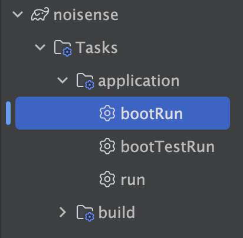

# 🎧 NoiSense (Noise × Sense)

> **소음 민원 + 시민 감정 분석 기반 체감 소음 시각화 플랫폼**

생활불편신고, 공공 API 데이터를 기반으로  
지역별·시간대별 소음 민원 발생 밀도와 감정 키워드를 분석하여  
'체감 소음 점수'를 지도 위에 시각화하는 시민 체감형 데이터 서비스입니다.

---

## 📌 프로젝트 개요

- **프로젝트명:** NoiSense (Noise + Sense)
- **목적:**  
  시민에게는 **거주지 선택**에 도움을 주고,  
  정책결정자에게는 **정책 수립의 근거**가 될 수 있는 체감형 소음 데이터 제공

- **핵심 특징:**
  - 소음 민원 + 감정 분석 기반 **체감 소음 점수화**
  - **Elasticsearch**를 활용한 시간·공간 기반 실시간 분석
  - 지도 시각화를 통한 사용자 친화적 정보 제공


---

## 📊 주요 기능

- 🔍 **소음 민원 밀도 분석**: 지역·시간대별 소음 민원 건수 집계
- 🧠 **감정 키워드 분석**: 민원 텍스트 기반 키워드 추출 및 가중치 부여
- 📈 **체감 소음 점수 산출**: 민원 수치 + 감정 키워드를 통한 점수 계산
- 🗺 **지도 시각화**: geo_point 기반 소음/감정 점수의 지역 시각화
---

## 🛠 기술 스택

| 분류 | 기술                                                               |
|------|------------------------------------------------------------------|
| Frontend | React, Next.js                                                   |
| Backend | Spring Boot, JPA, Redis, Elasticsearch                           |
| Infra | Docker, GitHub, Nginx, AWS EC2, AWS RDS (PostgreSQL), Git Action |
| Data | 서울시 열린데이터광장 API, 감정 사전 기반 키워드 추출                                 |


---


## 프로젝트 구조
```
project-root/
├── Data/                # DB (local-자동실행 docker-compose, 개발-AWS RDS에 입력하는 초기데이터,자동실행x)
├── Elasticsearch/       # Elasticsearch Dockerfile (monitoring 쪽에서 실행함)
├── infra/               # infra - AWS EC2 서버에서 실행 (Nginx, Redis) (서버에서 배치는 실행하지 않음_80만건..)
├── monitoring/          # monitoring - AWS EC2 서버에서 실행(elasticsearch, kibana, logstash)
├── backend/             # Spring Boot 프로젝트
│   ├──.gitignore
│   ├── build.gradle
│   └── ...
├── frontend/            # React + npm or pnpm
│   ├──.gitignore
│   ├── package.json
│   └── ...
└── README.md
```

-------------------------------------------------------

## 🚀 빠른 시작

### 1. 환경 요구사항
- Java 17 이상
- Node.js 18 이상
- npm 또는 pnpm
- Gradle 7 이상

### 2. 프로젝트 클론
```bash
git clone https://github.com/NoiSense-Noise-X-Sense/noiSense.git noisense
cd noisense
```


#### ⚙️ 개발 서버 실행 방법

✅ 백엔드(Spring Boot)
```bash

noisense> Tasks> application> bootRun

```
✅ 프론트엔드(React)
```bash
cd frontend
npm install        # 또는 pnpm install
npm run dev        
```
> front 3000, back 8080


### 환경변수 설정

- frontend/.env.development
- frontend/.env.production (Git Action 배포시 자동생성)


- backend/src/main/resources/application.yml
```yaml
server:
  port: 8080
```


### 테스트 (선택)

백엔드 테스트
```bash
cd backend
./gradlew test
```


-------------------------------------------------------


# 🧩 NoiSense - Spring Batch 실행 가이드 (운영 배포용)

본 문서는 NoiSense 프로젝트에서 시간 기반 배치 작업(Spring Batch)을 운영 환경에 배포하고 실행하는 방법을 안내합니다.

> 🎯 Job 이름: `hourlyNoiseJob`  
> 📌 목적: 센서 API 수집(오전 9시 30분, 오후 3시 30분) 및 하루 1회 대시보드 통계 생성

---

## 📁 디렉토리 구조
```
noisense/
├── backend/              # Spring Boot Backend
│      └── Dockerfile     # 배치용 Dockerfile
├── frontend/             # Next.js Frontend
└── infra/
       └── k8s/
            └── batch-cronjob.yaml  # Kubernetes 배치 CronJob 정의
```

---


## 🚀 운영 실행 절차

### 1️⃣ 백엔드 JAR 빌드

```bash
cd backend
./gradlew clean bootJar
```

---

### 2️⃣ Docker 이미지 빌드 및 Push

```bash
# 이미지 빌드
docker build --platform=linux/amd64 \
  -t registry.dosion.com/noisense/backend-batch:1.0.0 .

# 이미지 Push
docker push registry.dosion.com/noisense/backend-batch:1.0.0
```

---

### 3️⃣ Kubernetes CronJob 배포

```bash
cd ../infra/k8s
kubectl apply -f batch-cronjob.yaml
```

---

### 4️⃣ CronJob 상태 확인 및 활성화

```bash
kubectl get cronjobs
kubectl get jobs
kubectl logs job/<JOB_NAME>
```

> CronJob이 정지 상태(SUSPEND: True)일 경우:

```bash
kubectl patch cronjob noisense-batch-job -p '{"spec": {"suspend": false}}'
```

---

## 🔁 배치 Job 구조

```
[hourlyNoiseJob]
  └── Step 1: apiStep (센서 API 수집)
         ↓
      Decider: dashboardTriggerDecider (하루 1회 실행 여부 판단)
      ├─ EXECUTE_DASHBOARD → Step 2: statStep (대시보드 통계 생성)
      └─ SKIP_DASHBOARD    → 종료
```
- `ApiDataFetchTasklet`: 센서 API 호출 및 저장
- `DashboardStatBuildTasklet`: 하루 1회 통계 생성

---

## ✅ 참고사항

- `batch-cronjob.yaml`의 `schedule` 필드로 실행 주기 설정 가능
- 모든 배포는 `이미지 빌드 → 레지스트리 Push → K8s 배포` 순으로 진행

